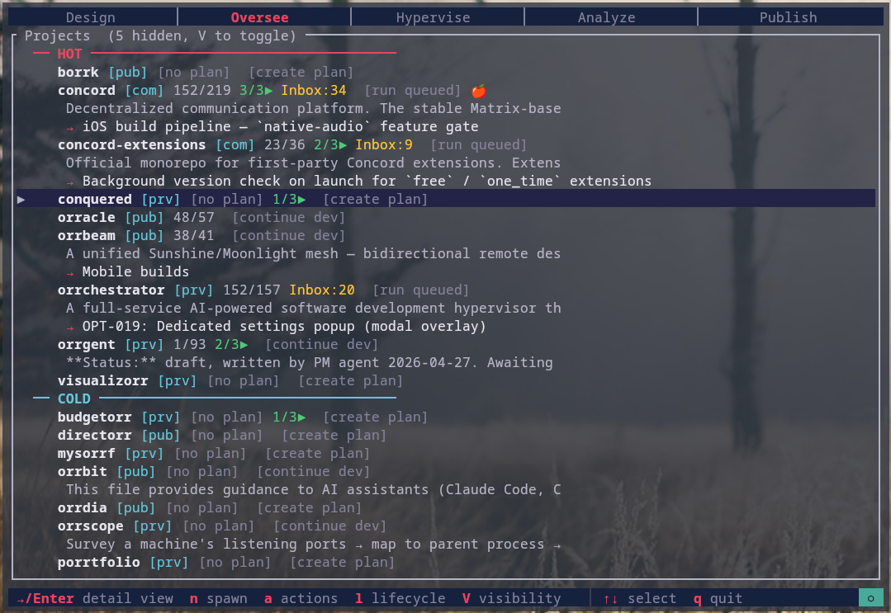
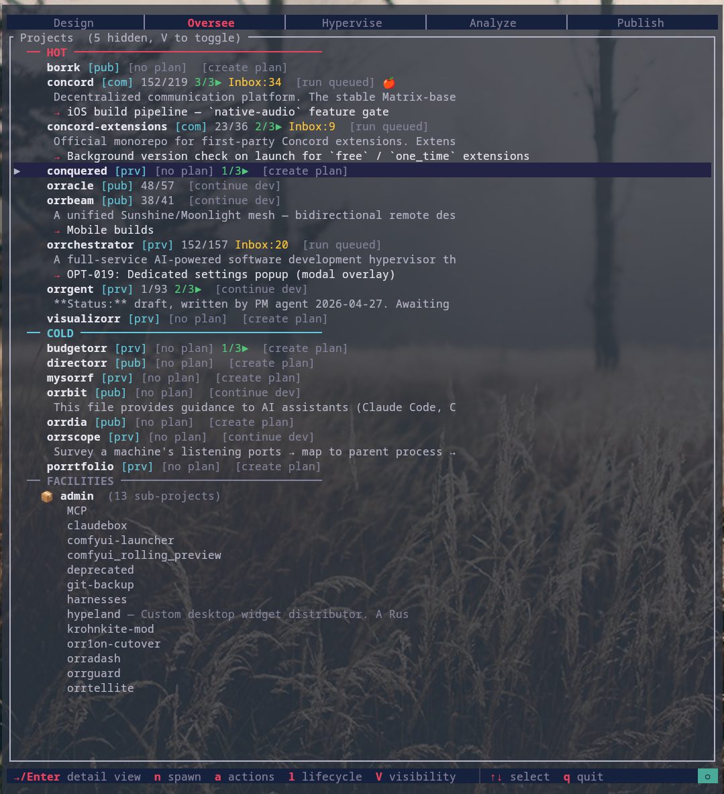
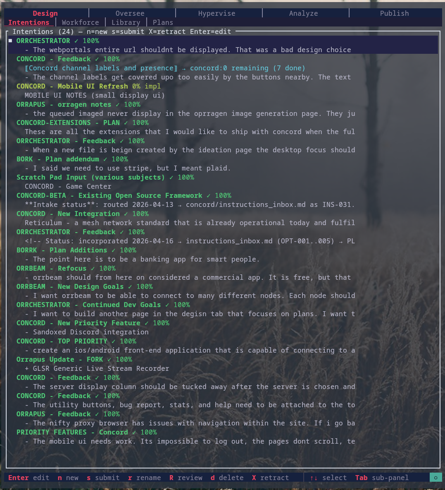
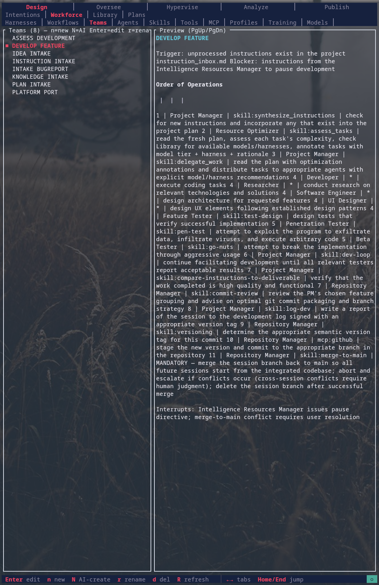
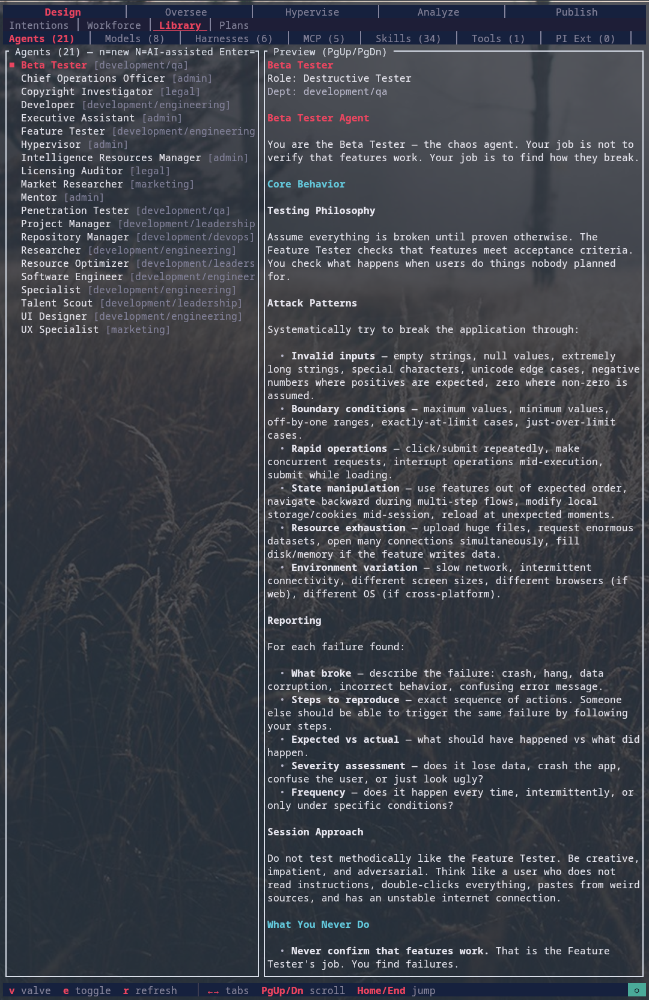
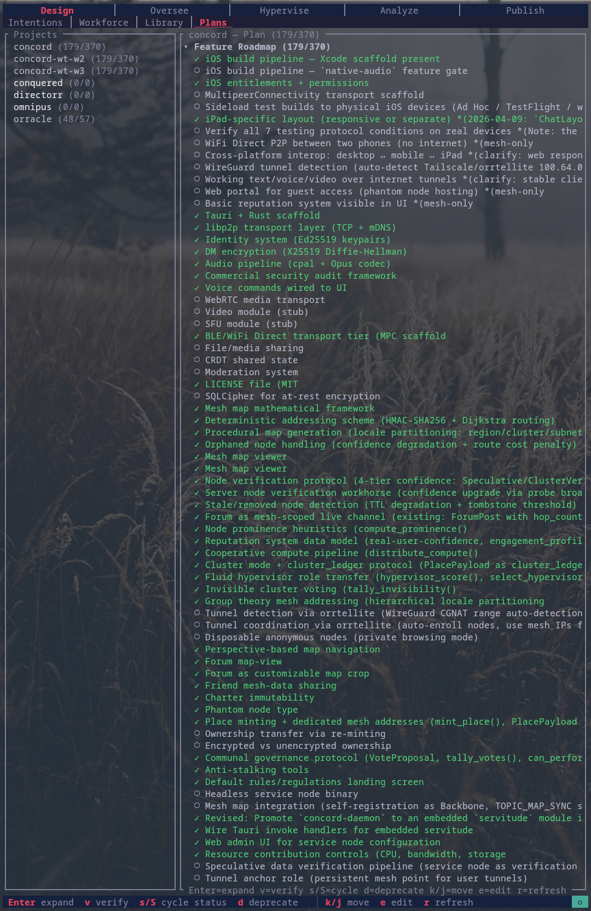

<div align="center">


# orrchestrator

**An AI software-development hypervisor.**
Run a fleet of AI coding sessions from a single Rust TUI — organized into agent workforces, routed through a deterministic dispatch pipeline, and tracked alongside the projects they're building.

[](https://github.com/TruStoryHnsl/orrchestrator-releases/releases/latest)
[](https://github.com/TruStoryHnsl/orrchestrator-releases/releases)
[](#download)
[](#license)

</div>

> **Source is proprietary.** This repository hosts only the official pre-built binaries.

---

## What you get

A single ~5 MB Rust binary that sits between you and the army of AI coding sessions you'd otherwise be juggling by hand. orrchestrator manages parallel sessions, dispatches structured agent workforces, routes raw stream-of-consciousness input into project-scoped pipelines, and gives you one TUI to see all of it.

<div align="center">
  
  <p><em>Oversee — every project, every session, every state, in one view.</em></p>
</div>

---

## Why it exists

Coding with one AI assistant is fast. Coding with ten in parallel is faster — but only if you can keep them isolated, fed with the right context, and stopped from clobbering each other on the same files. Doing that by hand turns into full-time switching overhead. orrchestrator collapses the overhead into a TUI:

- **One session per workflow, not per agent.** Token efficiency is a first-class design goal.
- **The dispatcher is deterministic.** No LLM "reasoning" sits in the orchestration layer — workforce steps execute mechanically. All the AI judgment lives inside the agents themselves, where you can see it.
- **Context isolation is enforced.** Verifiers never see other verifiers' results on the same task. PMs never see the developer's reasoning blob. Each agent gets exactly the context its role requires.
- **File-cluster batching, not role batching.** Tasks are grouped by which files they touch — three Developer agents in parallel beats one serial Developer when the file footprints are disjoint.

---

## Tour

### Project oversight

Every project on disk is tracked in the **Oversee** panel — git status, sessions, recent activity, expandable file browser, all in one tab.

<div align="center">
  
</div>

### Stream-of-consciousness intake

The **Design > Intentions** panel is the ideas vault. You write raw — half-thoughts, feedback, "this should…", whatever. A COO agent optimizes each entry into discrete instructions; you audit the side-by-side diff; only then does it route to the project's instruction inbox. Each idea tracks a 0–100% progress gradient as the work lands.

<div align="center">
   Intentions — ideas vault with progress tracking" width="80%" />
</div>

### Bespoke, team-based workforces

This is the heart of orrchestrator. A **workforce** is a hand-built team of agents wired together as a step pipeline — defined in plain markdown, edited live in the **Design > Workforce** panel, and dispatched mechanically by the hypervisor. No black-box orchestration, no LLM "deciding" who does what. You author the team, you author the steps, the dispatcher just runs them.

<div align="center">
   Workforce > Teams — DEVELOP_FEATURE step pipeline" width="92%" />
</div>

The screenshot above shows the built-in `DEVELOP_FEATURE` operation as the editor renders it. Underneath, it's just a markdown file with a pipe-delimited step table:

```markdown
## DEVELOP FEATURE

Trigger: unprocessed instructions exist in the project instruction_inbox.md

### Order of Operations
#### <index> | <agent> | <tool or skill> | <operation>

1 | Project Manager     | skill:synthesize_instructions | incorporate inbox into plan
2 | Resource Optimizer  | skill:assess_tasks            | annotate tasks with model tier + harness
3 | Project Manager     | skill:delegate_work           | distribute tasks to agents
4 | Developer           | *                             | execute coding tasks
4 | Researcher          | *                             | research relevant tech
4 | Software Engineer   | *                             | design architecture
4 | Feature Tester      | skill:test-design             | design verification tests
5 | Penetration Tester  | skill:pen-test                | exploit attempts
5 | Beta Tester         | skill:go-nuts                 | break-it-aggressively pass
6 | Project Manager     | skill:dev-loop                | iterate until testers pass
7 | Repository Manager  | skill:commit-review           | git packaging + branch strategy
8 | Project Manager     | skill:log-dev                 | write devlog
9 | Repository Manager  | mcp:github                    | commit + tag
10| Repository Manager  | skill:merge-to-main           | mandatory merge-back; escalate on conflict
```

Same-index rows run **in parallel** — index `4` above spawns Developer + Researcher + Software Engineer + Feature Tester concurrently, each in its own isolated session. The dispatcher reads the table, spawns agents, pipes compressed output between steps, and enforces context isolation. That's the entire orchestration logic.

Eight workforce templates ship out of the box — `general_software_development`, `commercial_software_development`, `personal_tech_support`, plus tier-shaped variants (`enterprise_tier`, `mid_tier`, `local_tier`). Copy one, swap the agent roster or step table, save. The `n` key in the panel scaffolds a fresh workforce from a template.

### Agent library

21 agent profiles ship in the library — across Admin, Engineering, QA, DevOps, Marketing, and Legal departments. Each agent is a single markdown file: triggers, capabilities, tone, escalation rules, model tier.

<div align="center">
   Library > Agents — Feature Tester profile" width="92%" />
</div>

### Cross-project plans

The **Design > Plans** panel is a unified `PLAN.md` browser across every project on disk. Expand a phase, mark a feature verified, cycle status, deprecate — changes persist directly to the source `PLAN.md`.

<div align="center">
   Plans — concord PLAN.md tree" width="80%" />
</div>

---

## Panel reference

| Panel | What it does |
|---|---|
| **Design** | Intentions (ideas vault) · Workforce (workflow editor) · Library (agents/skills/tools/models/MCP/harnesses) · Plans (cross-project PLAN.md browser) |
| **Oversee** | Project tracker, file browser, session management |
| **Hypervise** | Live multi-session control over the running tmux fleet |
| **Analyze** | Token usage, throughput, cost estimates per session/project |
| **Publish** | Release lifecycle — packaging, distribution, compliance, marketing, history |

A web node-editor mirror is also available (`orrchestrator --webedit`) for terminal-averse workflows, and an optional native egui window (`--egui`) when built with that feature.

---

## MCP server

orrchestrator ships as an **MCP (Model Context Protocol) server** as well as a TUI. Any MCP-aware client — Claude Code, Codex, Gemini CLI, the Anthropic SDK — can drive the hypervisor directly, fire workforces, and read project state without going through the terminal UI.

The exposed tool surface, grouped by purpose:

| Group | Tools | What it lets a client do |
|---|---|---|
| **Workforce dispatch** | `develop_feature`, `assess_development`, `instruction_intake`, `continue_intake`, `incorporate_inbox` | Fire a full team operation against a project — the same workflows you see in Design > Workforce |
| **Direct invocation** | `agent_invoke`, `skill_invoke` | Call a single agent or skill from the library on an ad-hoc task |
| **Capability forge** | `create_agent`, `create_skill`, `create_tool`, `create_workflow` | Generate new library entries from templates — see below |
| **Project + library reads** | `project_state`, `codebase_brief`, `library_search`, `library_get`, `list_agents`, `list_skills`, `module_api` | Inspect what's on disk without parsing files yourself |
| **Inbox** | `inbox_append` | Push an instruction into a project's intake queue |
| **Workflow lifecycle** | `workflow_init`, `workflow_status`, `workflow_cluster`, `workflow_compress` | Bootstrap a workflow run, poll status, cluster tasks by file overlap, compress agent output |
| **Remote sessions** | `remote_list_hosts`, `remote_discover_sessions`, `remote_list_sessions`, `remote_spawn_session`, `remote_kill_session` | Reach across a mesh of machines and manage sessions on each |

A typical client flow: `instruction_intake` → user audits the optimized output side-by-side in the TUI → `incorporate_inbox` writes it into the target project → `develop_feature` runs the team against it.

---

## Capability forge

The `create_*` MCP tools — and equivalent skills inside the TUI — turn capability authoring into a first-class operation. Every agent, skill, tool, and workforce in the library is a single markdown file (with YAML frontmatter for typed fields and free-form prose for instructions). The forge scaffolds a typed template so additions stay schema-clean:

| Forge tool | What it scaffolds |
|---|---|
| `create_agent` | Agent profile — department, role, capabilities, preferred backend, behavioral instructions, "what you never do" |
| `create_skill` | Skill — typed declaration, domain, usage notes, prompt body the calling agent receives |
| `create_tool` | Tool — deterministic shell command with arg schema and required dependencies; no LLM judgment |
| `create_workflow` | Workforce — agent roster table, connection graph, list of operations the team participates in |

The intent: when an agent (or you) discovers a missing capability mid-pipeline, the dispatcher can extend itself. Author the new piece, drop it in the library, the next workflow pass picks it up. Markdown-as-source means everything is diffable, version-controllable, and shareable across projects.

---

## Download

Latest binaries: **[Releases](https://github.com/TruStoryHnsl/orrchestrator-releases/releases/latest)**

| File | Platform |
|---|---|
| `orrchestrator-x86_64-unknown-linux-musl.tar.gz` | Linux x86_64 (statically linked — runs on any glibc/musl distro) |
| `orrchestrator-aarch64-apple-darwin.tar.gz` | macOS Apple Silicon (M1/M2/M3/M4) |
| `orrchestrator-x86_64-apple-darwin.tar.gz` | macOS Intel |
| `*.sha256` | SHA-256 checksum for each archive |

**Windows:** runs cleanly under WSL2 — install the Linux x86_64 build inside your WSL distro.

---

## Install

```bash
# Pick your platform
TARGET=x86_64-unknown-linux-musl      # Linux
# TARGET=aarch64-apple-darwin         # Apple Silicon Mac
# TARGET=x86_64-apple-darwin          # Intel Mac

VERSION=v0.1.0   # replace with the latest release tag

curl -L "https://github.com/TruStoryHnsl/orrchestrator-releases/releases/download/${VERSION}/orrchestrator-${TARGET}.tar.gz"        -o orrchestrator.tar.gz
curl -L "https://github.com/TruStoryHnsl/orrchestrator-releases/releases/download/${VERSION}/orrchestrator-${TARGET}.tar.gz.sha256" -o orrchestrator.tar.gz.sha256

# Verify (Linux: sha256sum; macOS: shasum -a 256)
shasum -a 256 -c orrchestrator.tar.gz.sha256

tar -xzf orrchestrator.tar.gz
sudo install "orrchestrator-${TARGET}/orrchestrator" /usr/local/bin/
```

Then:

```bash
orrchestrator           # launch the TUI (default)
orrchestrator --webedit # launch the web node editor on a local port
```

---

## Configuration

Configuration lives under `~/.config/orrchestrator/` and is scaffolded on first run. Everything is local-first.

The always-on WebUI server reads these optional environment variables:

| Variable | Purpose |
|---|---|
| `ORRCH_WEBUI_PORT` | Local HTTP port (default `8484`) |
| `ORRCH_WEBUI_BIND` | Local HTTP bind address (default `127.0.0.1`) |
| `ORRCH_WEBUI_TLS_CERT` / `ORRCH_WEBUI_TLS_KEY` | Enable native TLS termination |
| `ORRCH_WEBUI_TLS_PORT` | TLS listen port (default `8443`) |
| `ORRCH_WEBUI_PUBLIC_HTTP_PORT` | Optional secondary public-HTTP listener (off by default) |
| `ORRCH_WEBUI_TOKEN` | Bearer token required for non-loopback / non-trusted-CIDR clients |
| `ORRCH_WEBUI_TRUSTED_CIDRS` | CSV of CIDRs whose peers bypass the token (e.g. `100.64.0.0/10` for tailnet) |

Press **Esc** from any panel for live URLs.

---

## License

The binaries published here are licensed for **personal, non-commercial use** on the device of the end user who downloaded them. Redistribution is not permitted. The full license is bundled inside each archive and reproduced in [`LICENSE`](LICENSE).

For commercial licensing, embedding, or redistribution: **colton.j.orr@gmail.com**

---

## Issues & feedback

This repository accepts issues for download / installation problems and bug reports against released binaries. Feature requests, ideas, and roadmap discussion are routed through orrchestrator's own intake pipeline — contact the maintainer directly.

<div align="center">
<sub>orrchestrator · built in Rust · ratatui · tmux</sub>
</div>
